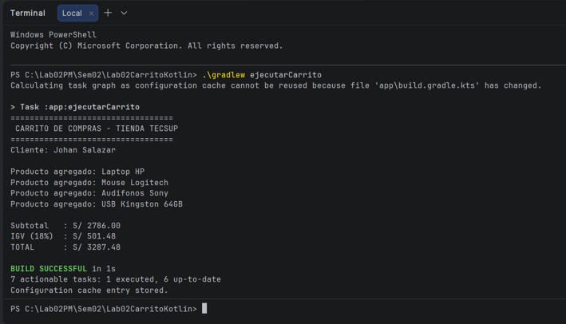
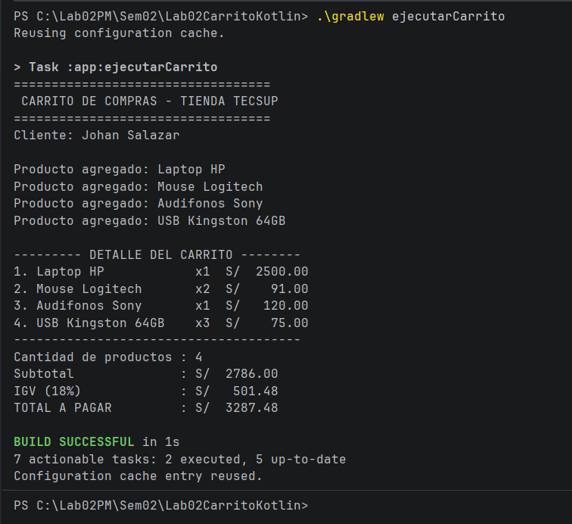
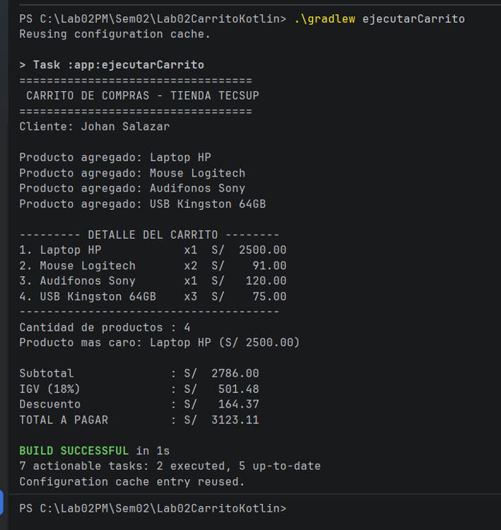

# Laboratorio 02: Carrito de compras en Kotlin
**Curso:** Programación en Móviles  
**Docente:** Juan José León Suiyon  
**Estudiante:** Johan Salazar Atencio

---

## Descripción del Proyecto
Este proyecto implementa la lógica de un carrito de compras desarrollado en **Kotlin** para ejecución por consola. Permite administrar productos, calcular subtotal, IGV y total a pagar, identificar el producto más caro y aplicar descuentos condicionales según el monto alcanzado.

### Funciones Implementadas
- `mostrarDetalle`: Muestra en consola la lista alineada de productos con formato de moneda.
- `calcularSubtotal`: Calcula la suma de importes (precio * cantidad) de los productos.
- `calcularIGV`: Retorna el 18% correspondiente al impuesto del subtotal.
- `calcularTotal`: Realiza la suma del subtotal y el IGV.
- `calcularDescuento`: Aplica lógica condicional (`when`) para otorgar 5% o 10% de descuento según el total.

---

## Pregunta de Reflexión (Parte 2)
> **¿Por qué `nombre` y `precio` son `val` pero `cantidad` es `var`? ¿Qué pasaría si intentas cambiar el precio después de crear el producto?**

- **Respuesta:** Se utiliza `val` en `nombre` y `precio` porque son propiedades inmutables que no deben cambiar una vez definido el producto. Por el contrario, `cantidad` utiliza `var` porque es una variable mutable, permitiendo incrementar o modificar las unidades elegidas en el carrito.
- Si se intenta modificar el valor de una propiedad declarada con `val` (por ejemplo: `producto.precio = 50.0`), el compilador de Kotlin genera un error de compilación (*Val cannot be reassigned*), impidiendo la ejecución del programa.

## Capturas de Ejecución por Commit

### Commit 2: Carga de productos y totales iniciales

### Commit 3: Reporte de detalle con columnas alineadas

### Commit 4: Producto más caro y descuento condicional
